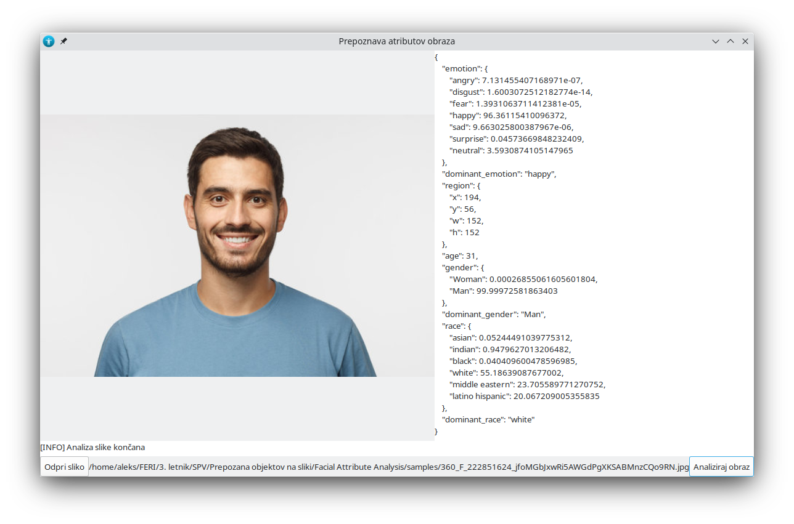

# MotoGether-FaceAttributeAnalysis
> Analiza profilnih slik za pridobitev različnih podatkov o uporabnikih

Primarne tehnologije:
- *DeepFace* knjižnica za analizo
- *Gkt* knjižnica za vmesnik (in *Glade* orodje za generiranje)

---

## GUI program

Zaganjanje GUI programa:
```
$ python3 app.py
```



_* Primerno za demonstracijo storitve._

---

## CLI program

> Program je namenjen za uporabo kot ločena storitev v Dokerju

Zaganjanje CLI programa:
```
$ python3 cli.py
```

_* Trenutno izbrana baza je testna. Povezava do produkcijske baze je zakomentirana v kodi_

---

## Iskanje prijateljev

> Algoritem omogoča iskanje prijateljstev preko klasičnih parametrov iz baze (ime, priimek) kot tudi analize slike (starost, spol, izražena čustva, ...). Išče čim več podobnosti, katere pa imajo različen vpliv na izbiro prijateljev.

### Uporabljene uteži za prijateljstva:
- starost
- spol
- etnična skupina
- izražena čustva na sliki

### Postopek

Poiskani prijatelji se izračunajo in v podatkovno bazo zapišejo pod seznam z imenom `possible_friends` in `n` (privzeto 5) `ObjectId` elementov, kjer je posamezni vnos referenca na uporabnika.

---

## Ovire

> Pri implementaciji algoritma je že v začetku bilo nekaj ovir. Podani podatki mi niso podajali prevelikega števila podatkov.

`REŠITEV:` Podana mi je bila slika profila. To sem analiziral in pridobil nekaj podatkov. Čeprav podatki ne izražajo atributov, kateri "zagotovo" zagotavljajo prijateljstva, so vseeno veliko vredni. Več različnih statističnih analiz je dokazalo, da se ljudje istih starostnih skupin, spolov in etničnih skupin družijo več časa skupaj kot ostali ljudje. 

> Ni predpisa, kako oceniti prijateljstva. Kako naj določim pravilo, kareto osebo priporočiti kot prijatelja?

`REŠITEV:` Spletna raziskovanje v kombinaciji s kratkimi vprašalniki na manjši skupini ljudi so prikazali, katere lastnosti koliko pomeniju nekomu na njegovem prijatelju. Posamezne lastnosti sem obtežil in naredil točkovnik, kjer se točke gibljejo od 0 do 300 enot.

*Pri tej rešitvi gre velika zavhala številnim prijateljem, kateri so mi prostovoljno pomagali zbrati potrebne podatke.*

